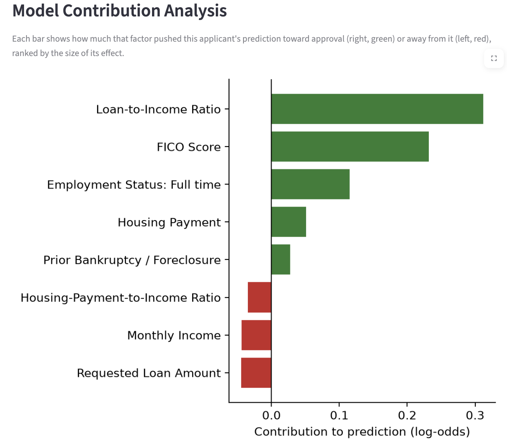
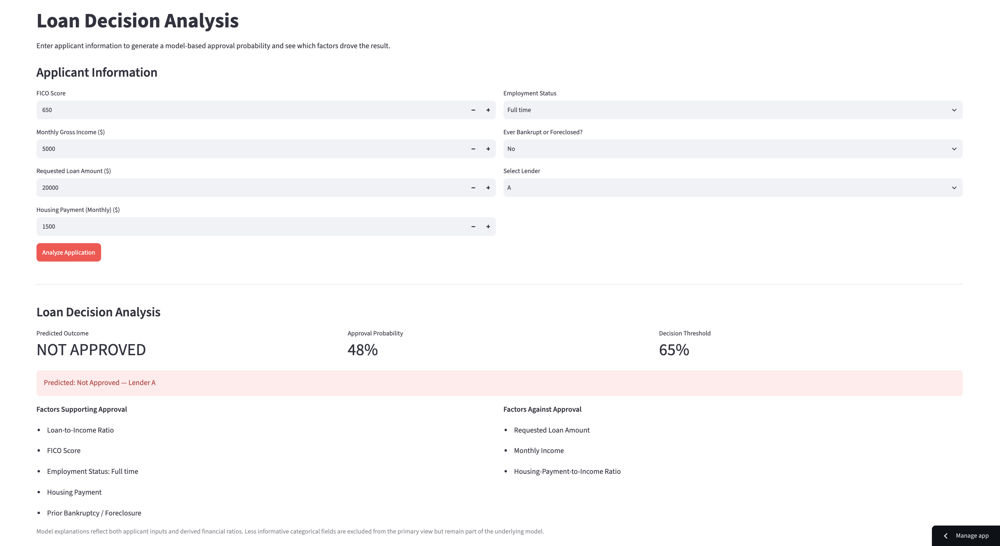

# Loan Decision Analysis Tool

A Streamlit-based machine learning application that estimates loan approval probability and explains the key applicant-level factors influencing each prediction using SHAP.

The project combines predictive modeling, explainable AI, and business-facing dashboard design to demonstrate how machine learning can support transparent, interpretable decision workflows.

---

## Live Application

Use the deployed application to enter applicant information and generate a loan approval prediction.

[](https://loan-approval-app-tbuapahz8eqoxnk4cvjwdv.streamlit.app/)

**[Launch the Loan Approval Application →](https://loan-approval-app-tbuapahz8eqoxnk4cvjwdv.streamlit.app/)**

### Application Preview

---

## Model Development Notebook

The Google Colab notebook documents the data preparation, exploratory analysis, model training, model evaluation, and deployment workflow used to develop the application's predictive models.

[](https://colab.research.google.com/drive/1OEfelXF_CHhORGh6P5sKv1oojybZbq_r)

**[View the Model Training Notebook →](https://colab.research.google.com/drive/1OEfelXF_CHhORGh6P5sKv1oojybZbq_r)**

---

## Project Overview

The goal of this project is to demonstrate an end-to-end machine learning workflow for loan approval analysis.

The application allows a user to enter applicant information, generates an approval probability using a trained logistic regression model, and provides an applicant-level explanation of the prediction.

Rather than displaying only a binary outcome, the upgraded application also identifies the factors that most strongly support or work against approval.

This creates a more transparent decision-support experience and demonstrates how explainable AI can make predictive models easier for business users to interpret.

---

## Key Features

- **Loan approval probability**
  - Generates an applicant-specific probability of approval.

- **Predicted outcome**
  - Classifies the application as `APPROVED` or `NOT APPROVED` using a 65% decision threshold.

- **Applicant-level explainability**
  - Uses SHAP values to explain why the model produced a particular prediction.

- **Supporting and opposing factors**
  - Separates the strongest model drivers into factors supporting approval and factors working against approval.

- **Model contribution visualization**
  - Displays a signed horizontal contribution chart showing how strongly each major factor pushes the prediction toward or away from approval.

- **Human-readable model explanations**
  - Converts encoded and engineered model features into business-friendly labels.

- **Technical explanation view**
  - Provides access to the complete SHAP feature-level explanation and local-accuracy verification for users interested in the underlying model behavior.

---

## Decision Analysis Workflow

```text
Applicant Information
        ↓
Feature Engineering
        ↓
Feature Encoding
        ↓
StandardScaler
        ↓
Logistic Regression
        ↓
Approval Probability
        ↓
SHAP Explanation
        ↓
Decision Drivers & Contribution Analysis
```
---

## Explainable AI & Model Contributions

The application uses SHAP to provide applicant-level explanations for each model prediction.

Rather than showing only an approval probability, the dashboard identifies the factors that most strongly influenced the result and separates them into:

- factors supporting approval
- factors working against approval

The contribution visualization shows the direction and relative strength of each major model driver for the individual applicant, translating the model's output into a more interpretable business-facing analysis.

### Model Contribution Analysis



The underlying SHAP calculation evaluates the complete trained feature set, while the primary visualization focuses on applicant-provided and directly derived features that are most meaningful to the user.
